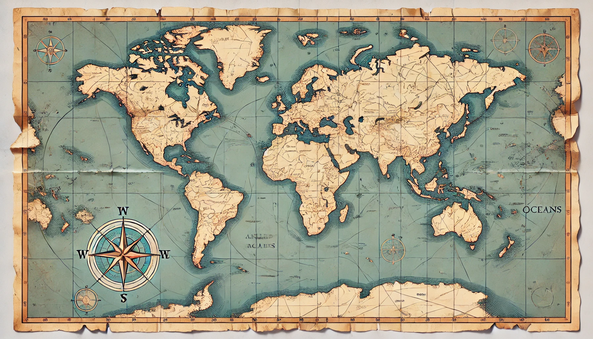

<!--
---
title: "SafeZone"
excerpt: ""

collection: portfolio
---
* I worked on this project as a competitior in the 6th Annual Datathon for Social Good: Human Rights, and my team ended up getting <a href = "/portfolio/datathon_certificate.png" >second</a> place!
* Our Slide deck can be found <a href = "https://docs.google.com/presentation/d/1QkuAybI4W9_bSNdGGpAqLhA5ZSEXisOCTSherPejiB0/edit?usp=sharing" target = "_blank">here!</a>
* GitHub Repository for this project can be found <a href = "https://github.com/brandonconcepcion/SafeZone" target = "_blank">here!</a>

## Description 
* Utilized the Armed Conflict Location & Event Data (ACLED) API to achieve 93% accuracy in classifying regions likely to experience any fatalities from escalating political events, aiding Doctors Without Borders to identify high-risk zones.
* Preprocessed over 2 million political events across 74 features and 180+ countries to train 2 Multilayer Perceptrons, achieving an R² score of 0.76 in predicting the number of fatalities for regions with escalating political events
* Developed a Streamlit app to visualize conflict severity and fatality predictions, enhancing humanitarian safety management.

### Tools
* Streamlit
* Pandas
* ACLED API
-->
