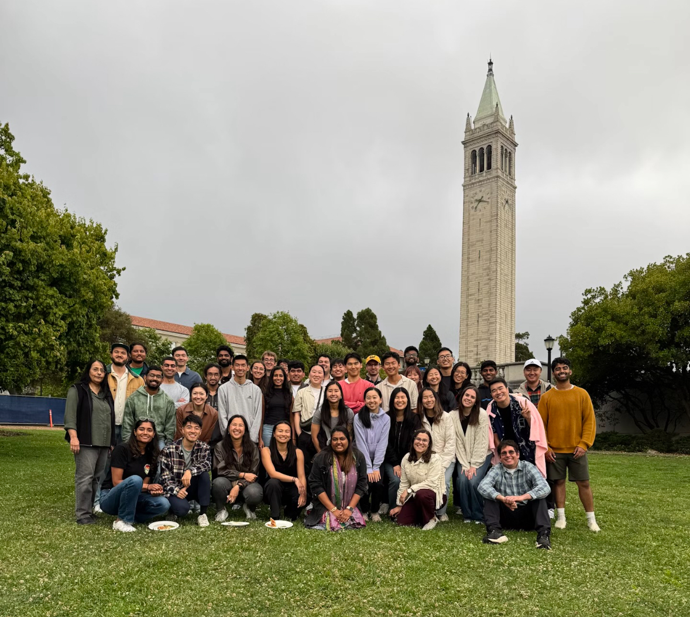
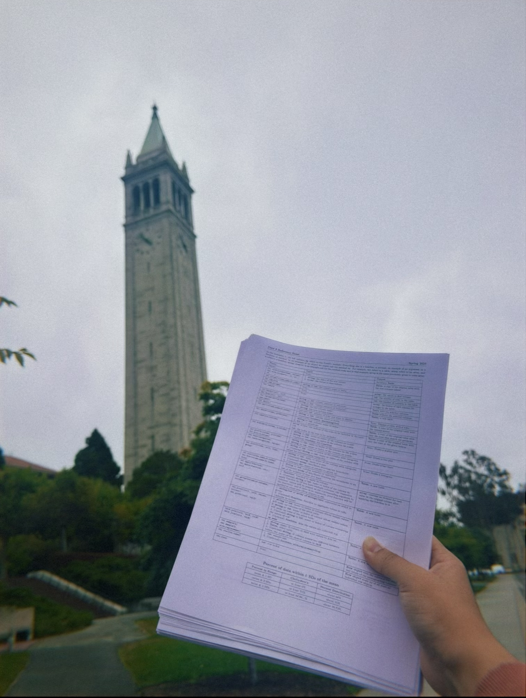
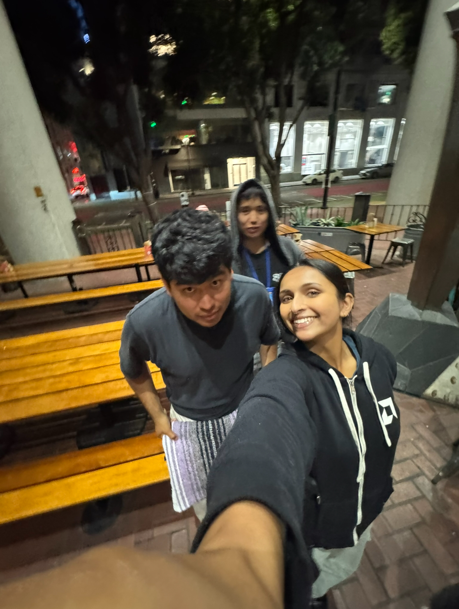
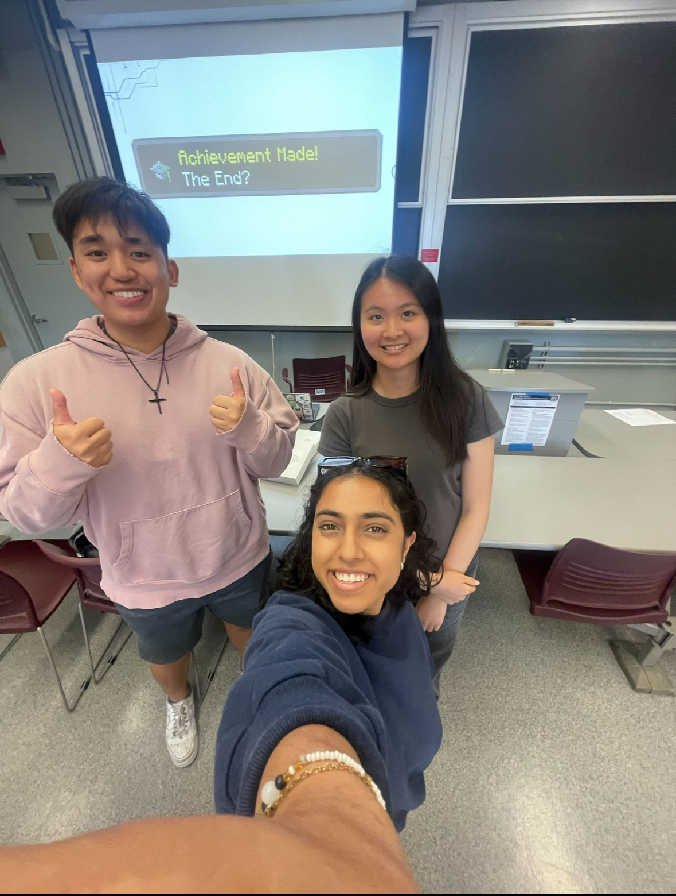
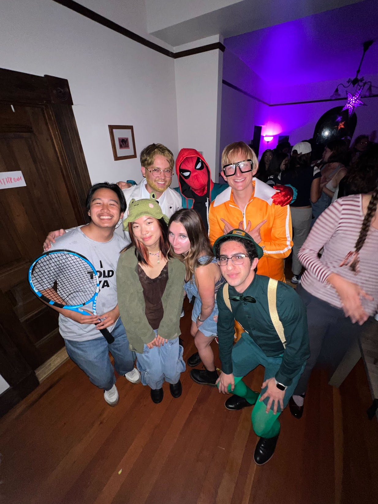
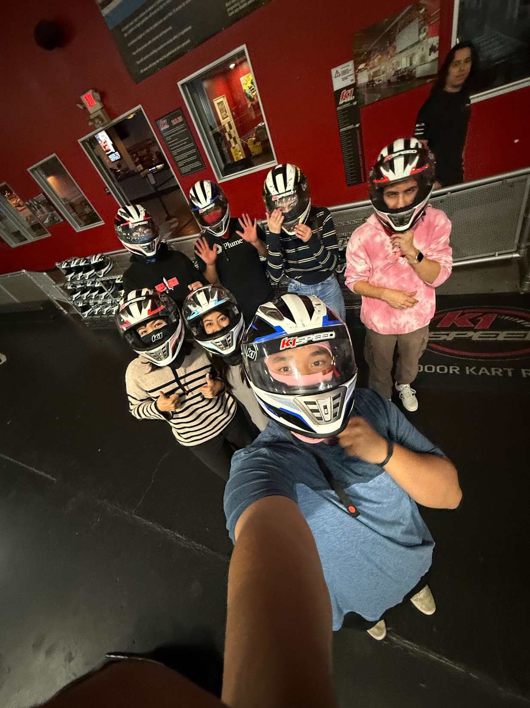

* Course Materials for Summer 2025 can be found <a href = "https://linktr.ee/bingsu25" target = "_blank">here</a>

### Other Responsibilities
* Student support and grading responsibilities!

### Photos

    

        
        

            
👩‍🏫 10 year Data 8 reunion

        

    

    

        
        

            
📝 On the way to Data 8 midterm

        

    

    

        
        

            
🌮 Taco Tuesday in SF

        

    

    

        
        

            
👌 My Lab supoorts <a href = "https://www.linkedin.com/in/anirra-kutty/" target = "_blank">Anirra</a> and <a href = "https://www.linkedin.com/in/monicatsai212/" target = "_blank">Monica</a>

        

    

<!--
### Photos

    

        
        

            
🔬 My lab supports Ishani and Bowie

        

    

    

        
        

            
🎅 Data 8 Secret Santa

        

    

    

        
        

            
🏆 Data 8 Banquet 

        

    

     

        
        

            
📸 My Data 8 Superlative

        

    

    

        
        

            
🎃 Halloween at Rory's

        

    

    

        
        

            
🚾 K1 Speed Racing!

        

    

-->