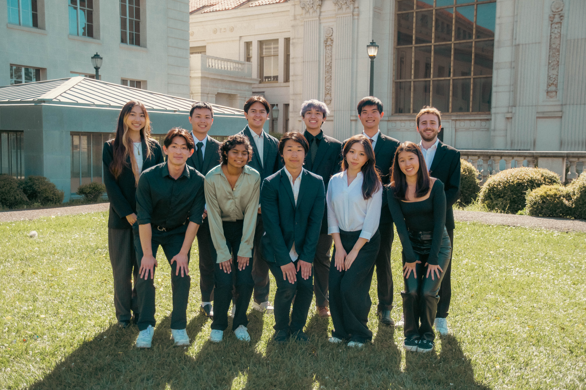
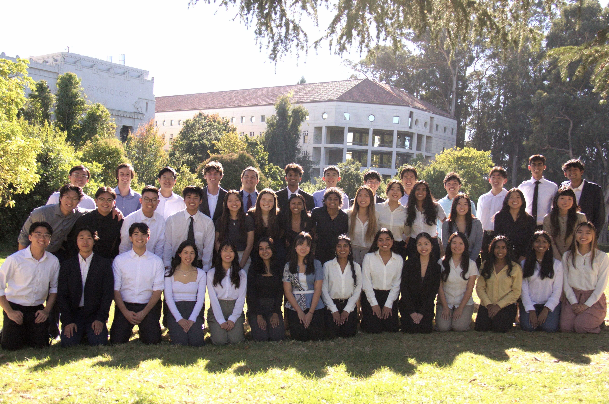
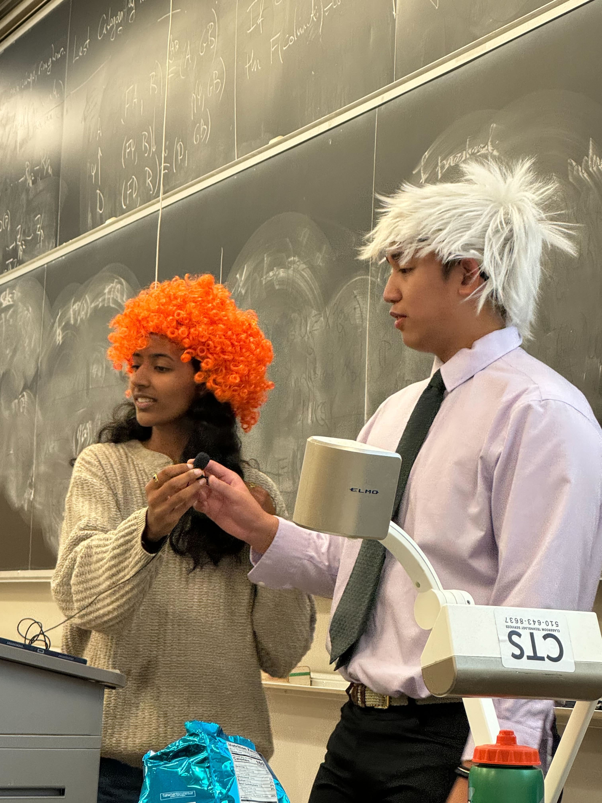
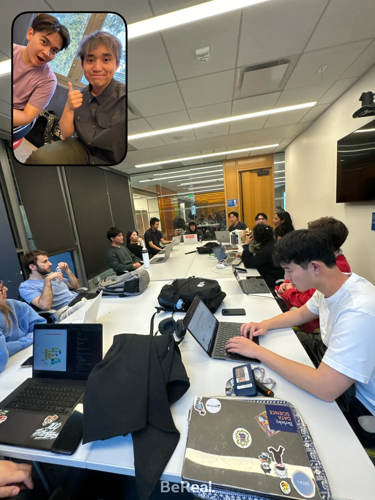

### Responsibilities:
* Managing 8 Teaching Assistants and 6 tutors to operate the <a href = "https://dss-data198.github.io/Data198/index.html" target = "_blank">“Introduction to Real World Data Science”</a> course, promoting data science accessibility by 5 hosting educational workshops from industry and academic leaders
* Teaching and facilitating 70+ diverse students towards the completion of an 8-week-long introductory data science project, lecturing on industry-level topics such as Pandas, data cleaning, data visualization, and machine learning 
* Explored domains in finance, sports analytics, and real estate while supporting 14 groups of 5 students through project planning, data cleaning, Exploratory Data Analysis, machine learning modeling, model testing, and ultimately a presentation on their findings 

## Photos

    

        
        

            
🐤 Academic Development Committee

        

    

     

        
        

            
🗃️ <a href = "https://dssberkeley.com/" target = "_blank">Data Science Society</a> at Berkeley

        

    

    

        
        

            
📊 Lecture on EDA with <a href = "https://www.linkedin.com/in/madhuri-suresh0404/" target = "_blank">Madhuri Suresh</a>

        

    

    

        
        

            
✅ First Academic Development Meeting

        

    

