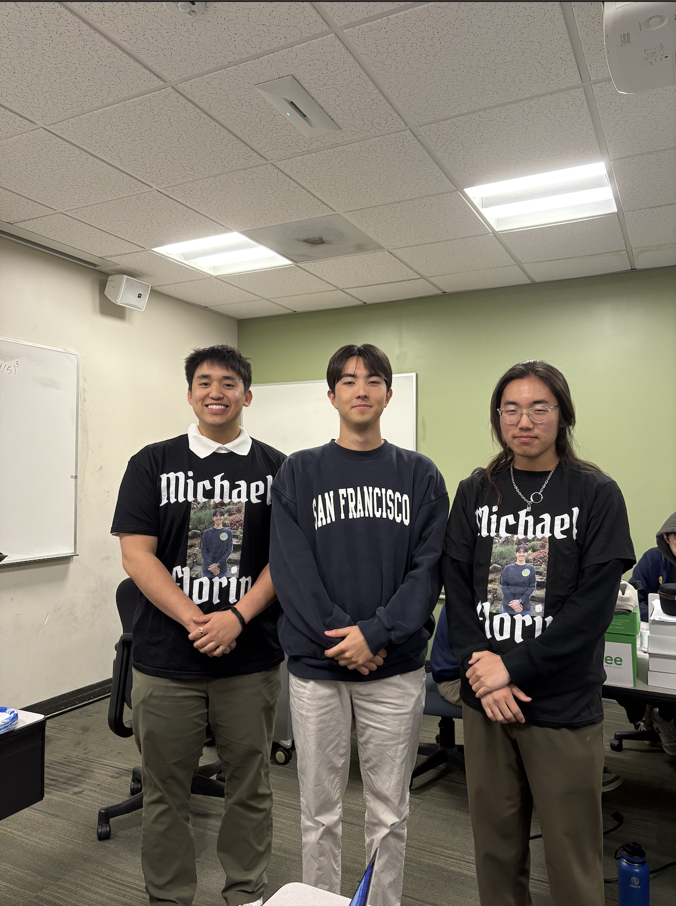
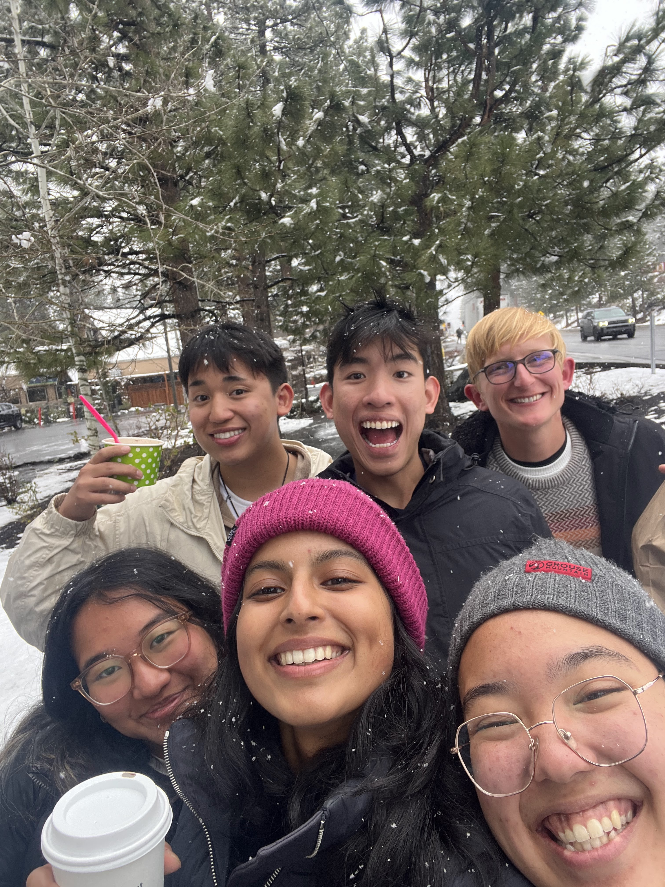
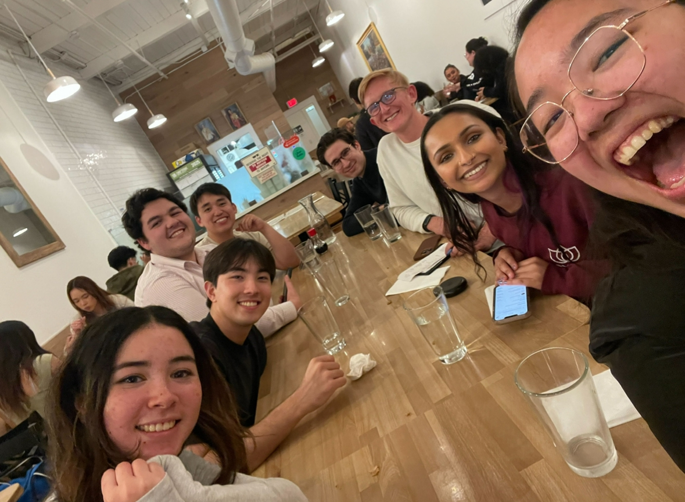

* Course Materials for Spring 2025 can be found <a href = "https://linktr.ee/bingsp25" target = "_blank">here</a>

### Other Responsibilities
* Collaborated with <a href = "https://www.linkedin.com/in/aileeenwu/" target = "_blank">Aileen Wu</a> to manage Data 8's grading infrastructure

### Photos

    

        
        

            
👩‍🏫 Visiting Professor Adhikari's lecture!

        

    

    

        
        

            
🧊 Brandon Squared!

        

    

    

        
        

            
🐐 Isaac and I with the GOAT

        

    

    

        
        

            
🍨 Data 8 gets Ice Cream in Tahoe

        

    

     

        
        

            
🎓 Photoshoot w/ Ramisha and Thomas

        

    

    

        
        

            
🏠 Dinner after midterm review session!

        

    

