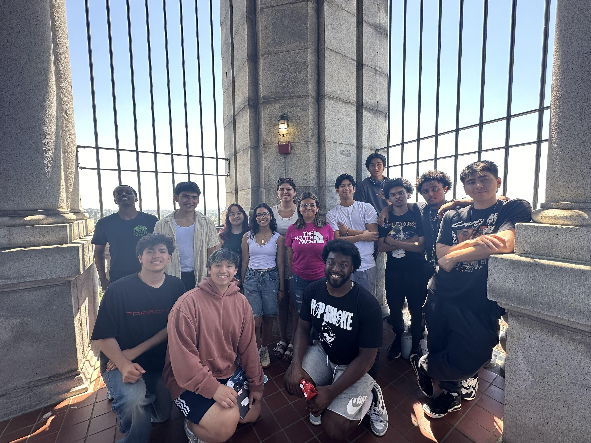
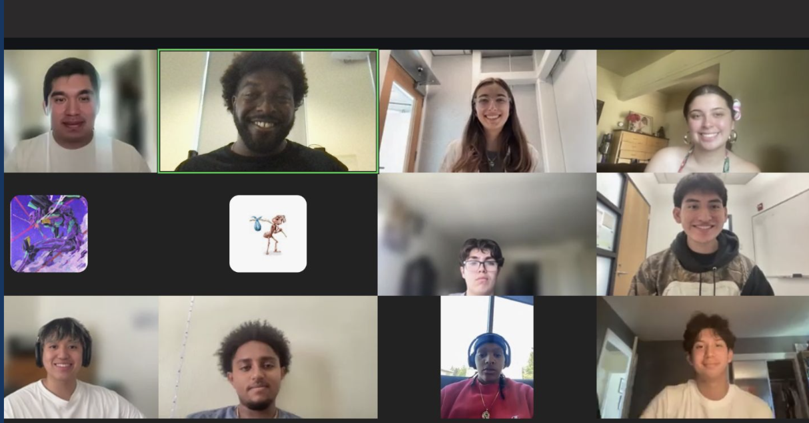

### Responsibilities:
* Collaborated with the [Achieve Program](https://achieveprogram.org/) to mentor 10 interns through individual data science projects, from browsing 100+ publicly available datasets, using Python to clean and analyze the data in Jupyter Notebooks, and ultimately decking for a <a href = "https://drive.google.com/drive/folders/1UO74eXEU5q_0TwPg9QWzYkzDQLNNoxqo?usp=sharing" target = "_blank">presentation</a> on their research findings
* Collaborated with 2 faculty directors and 2 lead facilitators to enhance the internship experience, integrating 12 learning reports and 10 external workshops featuring guest speakers from industry and academia

## Photos

    

        
        

            
🗼 BUDS visits the Campanile!

        

    

     

        
        

            
🗣️ Zoom with Speaker <a href = "https://www.linkedin.com/in/jessica-golden-/" target = "_blank">Jessica Golden</a>

        

    

