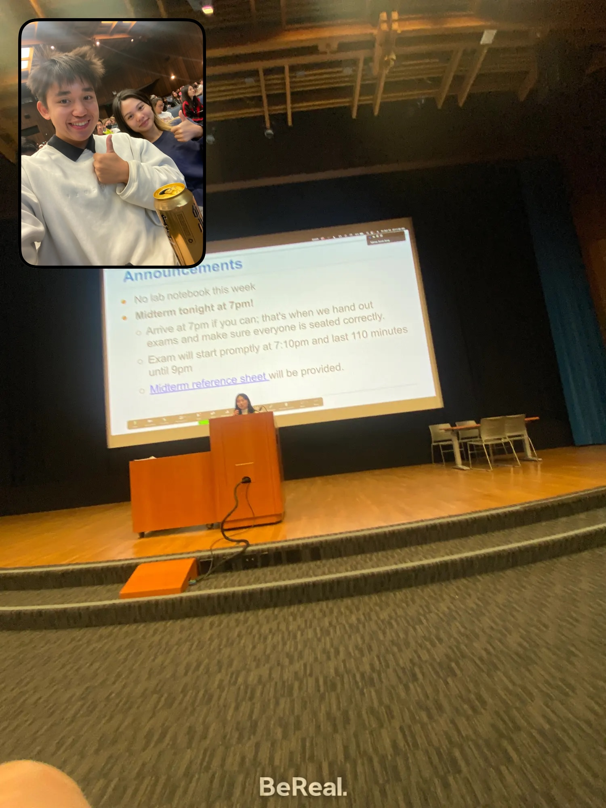
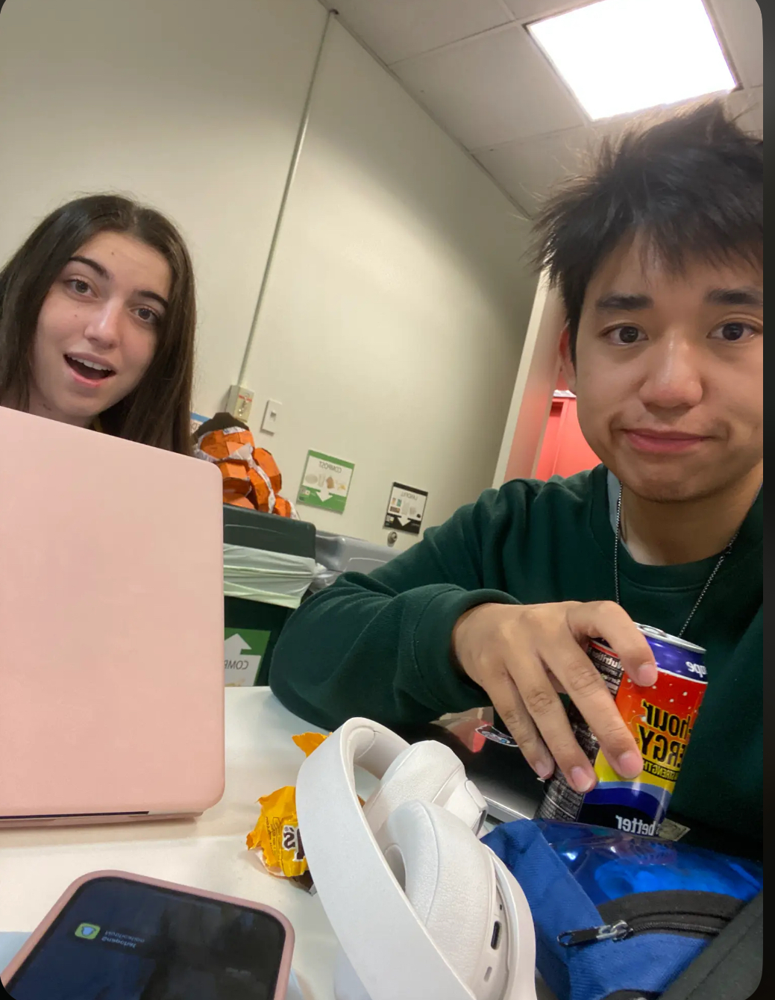
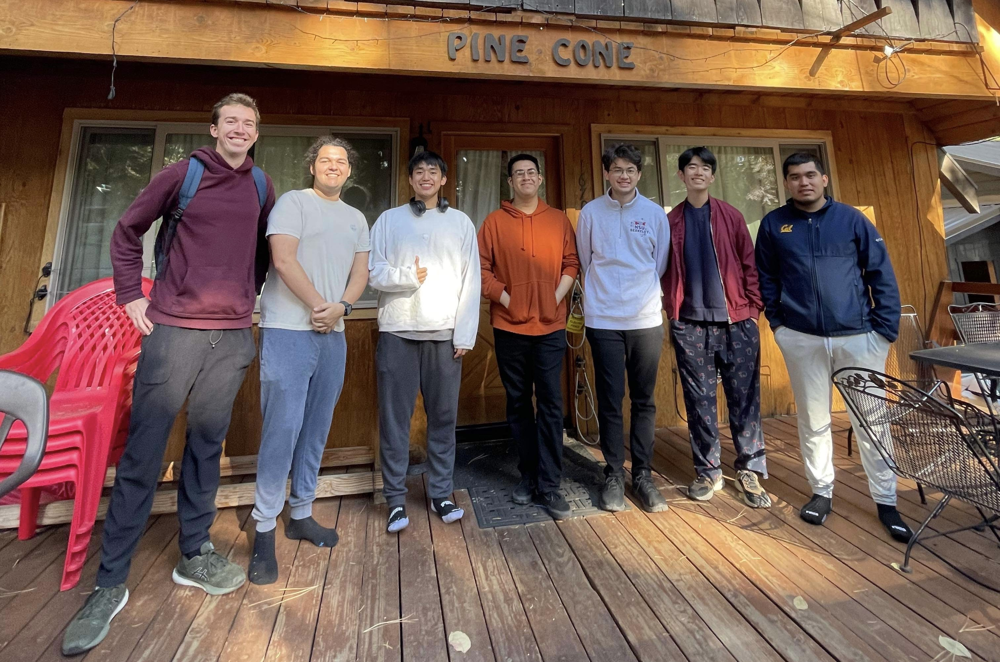
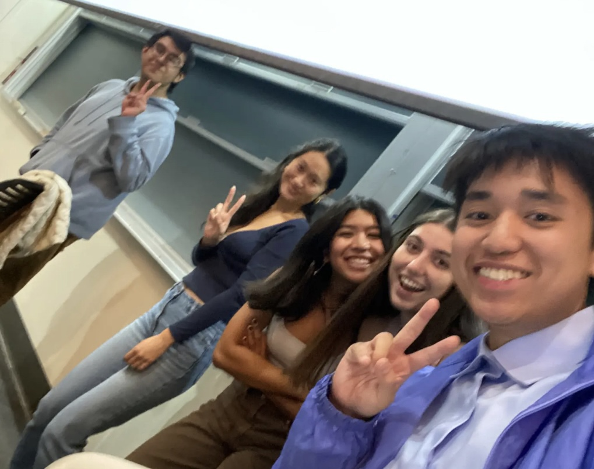

### Responsibilities:
* Guiding and supporting 20+ students toward a deeper understanding of foundational computer science, data science, and statistical concepts such as Exploratory Data Analysis, confidence intervals, hypothesis testing, and k-nearest neighbors classification
* Assisted 1000+ students by hosting 11 tutoring sections, 20 office hours sessions, grading 2000+ assignment questions, posting on student forums, and supporting 2 lab instructors

## Photos

    

        
        

            
📝 <a href = "https://www.linkedin.com/in/sarsong/" target = "_blank">Sarah's</a> Midterm Review Lecture + <a href = "https://www.linkedin.com/in/kelsey-ley/" target = "_blank">Kelsey</a>

        

    

     

        
        

            
🤝 Tutor Meeting with <a href = "https://www.linkedin.com/in/dagny-streit/" target = "_blank">Dagny</a>

        

    

    

        
        

            
🚣 Data 8 Trip to Lake Tahoe!

        

    

    

        
        

            
🙈 Proctoring my first Data 8 Midterm

        

    

