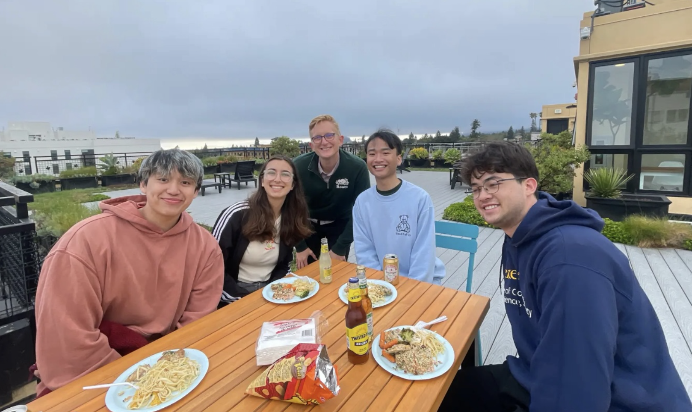
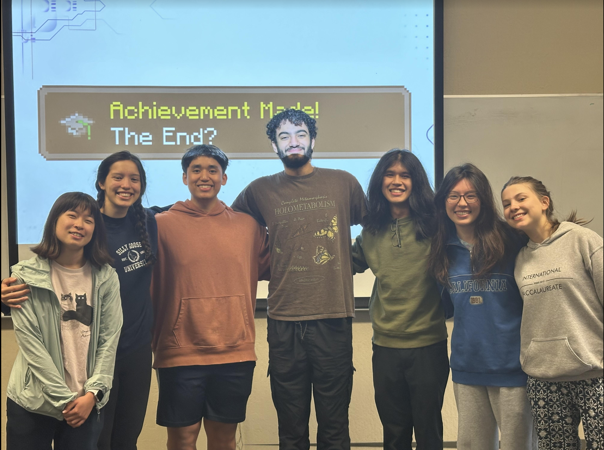
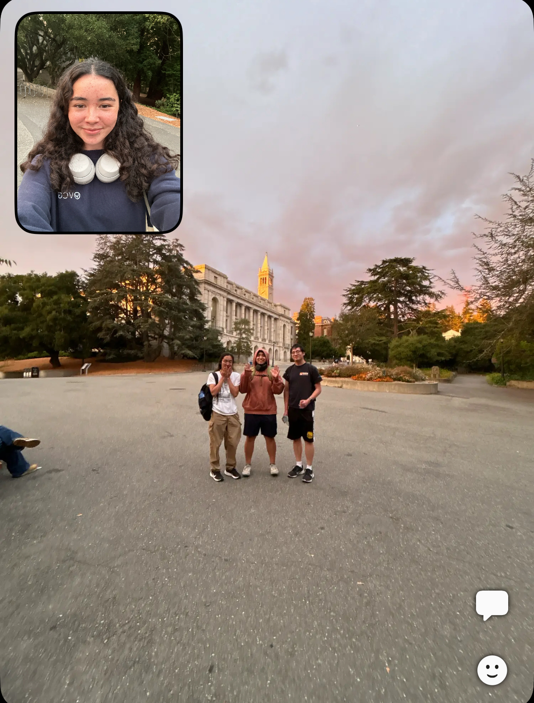
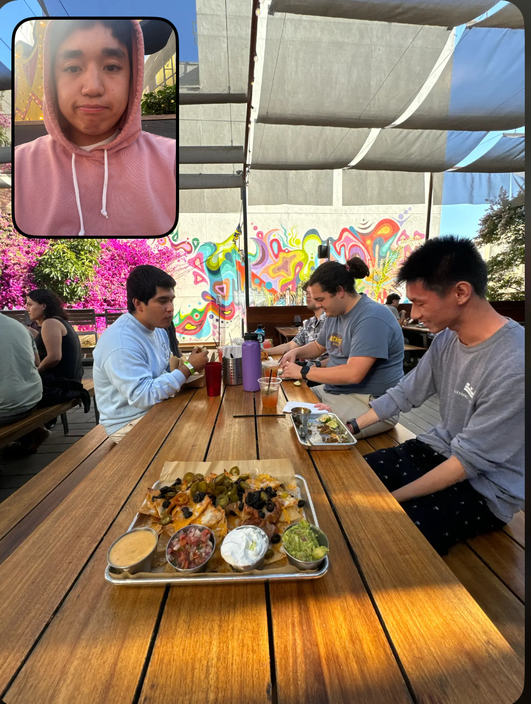

* Led my students to achieve average exam scores in the 90th percentile, as well as cumulative course grades in the 93rd percentile, highest among all student instructors

### Other Responsibilities
* Course Materials for Summer 2024 can be found <a href = "https://linktr.ee/bingSU24" target = "_blank">here</a> and Student Evaluations can be found <a href = "../files/Su24_Evals.pdf" target = "_blank">here!</a>
* Restructured data8.org/su24 using HTML, CSS, and Javascript for front-end web development, adding 19 dynamic <a href = "https://www.data8.org/su24/resources/#exam-problems-by-topic" target = "_blank">tabs</a> to organize 250+ past exam problems by their scope in the course
* Led 12 lectures and guided a section of 40 students through assignments, effectively explaining statistical theory and data science practices to a demographic with limited STEM backgrounds
* Implemented the Hover Photo feature for 20+ <a href = "https://www.data8.org/su24/staff/" target = "_blank">staff</a> members

### Photos

    

        
        

            
🥘 Staff Potluck

        

    

     

        
        

            
👨🏼‍🏫 My Tutor Supports and Students

        

    

    

        
        

            
🌇 Review Session Sunset

        

    

    

        
        

            
🌮 Data 8 Taco Tuesday

        

    

